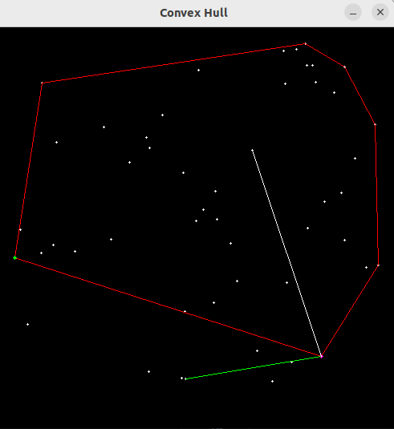
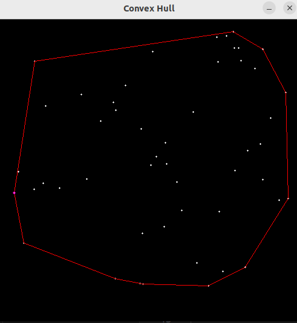

# Algorithms

This program/library is designed to solve a collection of computational geometry and graph theory problems. It includes implementations of several fundamental algorithms, and data structures to handle these problems efficiently.
To explore more algorithms and data structures vist [here](https://github.com/Kalashyan-1/Data-Structures).

## Table of Contents

- [Features](#features)
- [Dependencies](#dependencies)
- [Usage](#usage)
- [Implemented Algorithms](#algorithms-implemented)
    - [Convex Hull](#convex-Hull)
    - [SSSP Algorithms](#SSSP-Algorithmsl)
    - [Maximum Flow](#maximum-flow)
    - [KMP](#text-pattern-matching)
- [Screenshots](#screenshots)

## Features

The program/library provides the following features:

1. Finding the Convex Hull of a set of points in 2D space.
2. Computing the Shortest Path in a weighted graph using various algorithms.
3. Finding the Maximum Flow in a flow network using the Ford-Fulkerson algorithm.
4. Implementing a text pattern matching algorithm, Knuth-Morris-Pratt (KMP).
5. Running tests that read input from files to test the algorithms with custom data.
6. [Visualization](#screenshots) of the Convex Hull algorithm․

## Dependencies

To build and run the the project, you need the following:

1. C++ compiler supporting C++11 or later
2. Standard Library (STL)
3. CMake (minimum version 3.0)
4. [nlohmann/json](https://github.com/nlohmann/json)
5. [OpenCV](https://github.com/opencv/opencv.git) 

If CMake is not installed, you can install it by following the instructions for your specific operating system:

- Ubuntu/Debian: 
    ```shell
    sudo apt-get install cmake
    ```
- Fedora:
    ```shell
    sudo dnf install cmake
    ```
- macOS (Homebrew): 
    ```shell
    brew install cmake
    ```
- Windows:
You can download the CMake installer from the official website: [CMake installer](https://cmake.org/download/)


## Usage

To use the trading platform, follow these steps:

1. Clone the repository to your local machine.
    ```shell
    git clone https://github.com/Kalashyan-1/Algorithms.git 
    ```
2. Open a terminal and navigate to the program directory.
3. Create a build directory: 
    ```shell
    mkdir build
    cd build
    ```
4. Generate the build files using CMake:
    ```shell
    cmake ..
    ```
5. Build the program using the appropriate build system. For example, on Unix-like systems, use make:
    ```shell
    make
    ```
6. Run the program by executing the executable:
    ```shell
    ./Algorithms
    ```


## Implemented Algorithms 

The program implements the following algorithms:

### Convex Hull

The Convex Hull problem is implemented using the Graham Scan algorithm and the Jarvis March algorithm.

- Graham Scan: Complexity O(n * log(n))
- Jarvis March: Complexity O(n * h), where n is the number of input points, and h is the number of vertices in the convex hull.

### SSSP Algorithms

For the SSSP, the program provides various algorithms for finding the Shortest Path:

- Dijkstra's Algorithm: Complexity O((V + E) * log(V))
- Single-Source Shortest Path in a Directed Acyclic Graph (DAG): Complexity O(V + E)
- Bellman-Ford Algorithm with adjacency lists: Complexity O(V^3)
- Bellman-Ford Algorithm with edge list representation: Complexity O(V * E)


### Maximum Flow

To find the Maximum Flow in a flow network, the program implements the Ford-Fulkerson algorithm with Complexity O(F * E), where F is the maximum flow and E is the number of edges.


### Text Pattern Matching

The program uses the Knuth-Morris-Pratt (KMP) algorithm for text pattern matching with a complexity of O(N + M) where N is the length of the text and M is the length of the pattern.


## Screenshots





